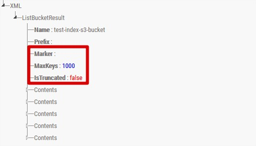

Title: Index y data dump en S3 Buckets abiertos
Date: 2020-07-07 14:05
Category: AWS
Tags: AWS, Powershell, Pentesting
Slug: index-y-data-dump-en-s3-bucket-publicos
Authors: J.R. Lambea
Summary: A raíz de un análisis de seguridad de una web, me encuentro con un portal en que permitía subir ficheros para el avatar en el que utilizaba la API de S3 para realizar las subidas y descargas a un Bucket S3, el problema es que ese acceso era público y además, con directory listing, por lo que permite a cualquiera saber que hay ahí dentro y descargar una copia de esos ficheros.

<!-- Modified: 2020-07-07 15:38 -->

En este caso presento un script de Powershell que permite recorrer un Bucket de S3 en el cual los permisos deben ser abiertos completamente (al menos de lectura) y público.

La API web de S3 es muy sencilla de utilizar, gracias a que permite peticiones GET, es posible realizar estas peticiones desde la misma barra de direcciones del navegador.

En el [enlace](https://docs.aws.amazon.com/AmazonS3/latest/API/API_ListObjects.html) se puede ver qué parámetros acepta esta API via URL:

- `delimiter`
- `encoding-type`
- `marker`
- `max-keys`
- `prefix`

Si se realiza una petición a la API, esta retornará un objeto en XML con la siguiente estructura, y en rojo marco las opciones que son interesantes por lo que se explicará a continuación:

<center>

</center>

Por diseño, la API sólo retornará cómo máximo los 1000 primeros objetos que encuentre, esto quiere decir que si hubieran más se deberá cambiar la consulta para que aparezcan los restantes, pero de haber más de 1000 nunca se podrá obtener la lista de todos los objetos de una sola consulta.

`max-keys` puede llevar a engaño por que sirve para restringir aún más ese número de elementos a retornar, **en ningún caso serviría para ampliar ese número de elementos a más de 1000**.

Pero tenemos dos atributos, `IsTruncated` que nos indica si el resultado se ha tenido que truncar debido al gran número de elementos, y `marker`, con el que podemos indicar a partir de qué elemento o clave queremos que nos muestre resultados, gracias a esto podemos saber si hay _más páginas_ de resultados, y en qué punto nos quedamos para seguir paginando.

El siguiente script Powershell permitiría indexar todos los elementos de dentro de un Bucket S3, y permitiría también descargarlos y tener una réplica de todo un bucket en local.

```powershell
[CmdletBinding()]
param (
    # S3 Bucket to target
    [Parameter()]
    [String]
    $Bucket,

    # AWS Region of the bucket
    [Parameter()]
    [String]
    $Region,

    # Object name prefix filter
    [Parameter()]
    [String]
    $Prefix = [String]::Empty,

    # Object name prefix filter
    [Parameter()]
    [Switch]
    $Download = $False
)

$bucketUrl="https://s3.${Region}.amazonaws.com/${Bucket}/"
$bucketUrlWithPrefix="${bucketUrl}?prefix=${prefix}"

[xml]$data = Invoke-WebRequest $bucketUrlWithPrefix

Write-Verbose "Find the first $(($data.ListBucketResult.Contents.Key).Count) objects."

$Objects = @()
$Objects += $data.ListBucketResult.Contents

$i=1

While ($data.ListBucketResult.IsTruncated -eq "true") {
    Write-Verbose "Crawling page: $i"

    $lastItem = $Objects[-1].Key
    [xml]$data = Invoke-WebRequest -Uri "${bucketUrlWithPrefix}&marker=${lastItem}"
    $Objects += $data.ListBucketResult.Contents

    Write-Verbose "Total Objects: $($Objects.Count)"

    $i++
}

If ($Download) {

    Write-Verbose "Creating folder ${Bucket}"

    New-Item -Type Container "${Bucket}"

    ForEach ($Object in $Objects) {
        $objectKey = $Object.Key.Trim("\")
        $objectPath = Split-Path $objectKey

        If (!(Test-Path $objectPath)) {
            New-Item -Type Container "${Bucket}/${objectPath}"
        }

        Invoke-WebRequest -Uri "${bucketUrl}${objectKey}" -OutFile "${Bucket}/${objectKey}"
    }
}

$Objects
```